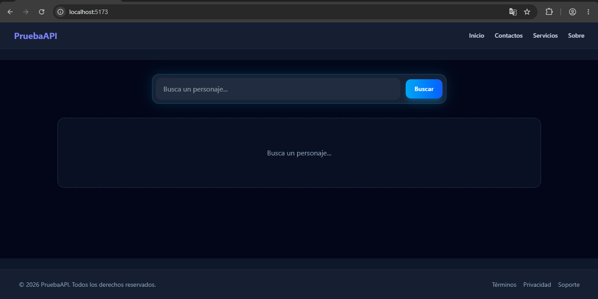
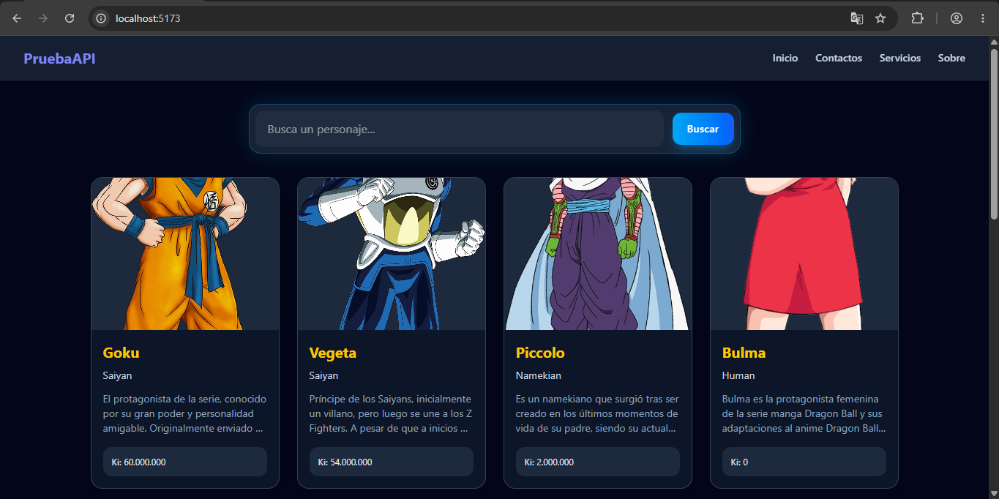
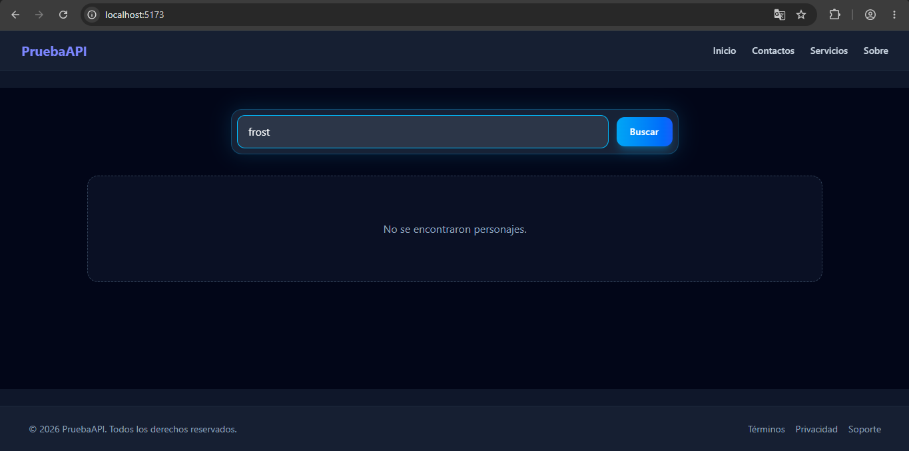

# Dragon Ball Z API Practice

Aplicación desarrollada con React, TypeScript y Tailwind CSS para practicar consumo de APIs REST, manejo de búsqueda por texto, render condicionado y tratamiento de errores.

---

## Descripción general

La app permite buscar personajes de Dragon Ball por nombre y mostrar una grilla visual con información relevante, como:

- nombre
- raza
- descripción
- ki
- imagen

El proyecto está organizado en componentes por responsabilidad y usa un servicio dedicado para encapsular la petición HTTP.

---

## Tecnologías

- React 19
- TypeScript
- Vite
- Tailwind CSS
- Axios
- PNPM

---

## Estructura del proyecto

```text
01-practice-api--dbz/
├── caps/
├── public/
├── src/
│   ├── api/
│   │   ├── base.axios.ts
│   │   ├── get-characters-by-query.ts
│   │   └── type.api.ts
│   ├── components/
│   │   ├── layout/
│   │   │   ├── Footer.tsx
│   │   │   ├── Header.tsx
│   │   │   └── Main.tsx
│   │   └── ui/
│   │       ├── Characters.tsx
│   │       └── SearchBar.tsx
│   ├── styles/
│   ├── App.tsx
│   ├── main.tsx
│   └── vite-env.d.ts
├── eslint.config.js
├── index.html
├── package.json
├── pnpm-lock.yaml
├── README.md
├── tsconfig.app.json
├── tsconfig.json
├── tsconfig.node.json
├── vite.config.ts
└── public/
```

---

## Modelo de datos

La API devuelve una respuesta con un objeto paginado y el arreglo de personajes dentro de `items`.

```ts
export interface DbzProps {
  id: number;
  name: string;
  ki: string;
  race: string;
  image: string;
  description: string;
}

export interface DbzResponse {
  items: DbzCharacter[];
  meta: Meta;
  links: Links;
}

export interface DbzCharacter {
  id: number;
  name: string;
  ki: string;
  maxKi: string;
  race: string;
  gender: Gender;
  description: string;
  image: string;
  affiliation: Affiliation;
  deletedAt: null;
}
```

---

## Lógica actual del flujo

### Servicio de consulta

En `src/api/get-characters-by-query.ts` se encapsula la lógica de la búsqueda:

```ts
export async function GetCharactersByQuery(query: string): Promise<DbzProps[]> {
  try {
    const response = await DbzApi<DbzResponse | DbzCharacter[]>("characters", {
      params: {
        name: query.trim(),
        limit: 10,
      },
    });

    const rawData = response.data;
    const characters = Array.isArray(rawData) ? rawData : rawData.items;

    return characters.length != 0
      ? characters.map((character) => ({
          id: character.id,
          name: character.name,
          ki: character.ki,
          race: character.race,
          image: character.image,
          description: character.description,
        }))
      : [];
  } catch {
    throw new Error("Error al consultar la API.");
  }
}
```

Esto permite:

- normalizar la búsqueda con `trim()`
- devolver un arreglo del tipo que usa la UI
- evitar exponer propiedades sobrantes del modelo completo
- centralizar el manejo de errores

### Estado del componente principal

En `Main.tsx` el estado se maneja en el componente padre:

```ts
const [characters, setCharacters] = useState<DbzProps[]>([]);
const [hasSearched, setHasSearched] = useState(false);
const [error, setError] = useState("");
const [loading, setLoading] = useState(false);
```

La búsqueda se dispara desde el formulario y se validan estos estados:

- `loading`: mientras espera la respuesta
- `error`: si la petición falla
- `hasSearched`: para distinguir entre “no se ha buscado aún” y “no hubo resultados”

---

## UI y diseño

La interfaz usa un estilo oscuro con un buscador centrado y una grilla responsiva de tarjetas para cada personaje.

El componente `Characters.tsx` maneja estas vistas:

- estado inicial: “Busca un personaje..."
- carga: “Cargando..."
- error: “Ocurrió un error...”
- sin resultados: “No se encontraron personajes.”
- resultados: tarjetas con nombre, raza, imagen y datos del personaje

---

## Instalación

### Requisitos

- Node.js 18+
- PNPM

### Comandos

```bash
pnpm install
pnpm dev
```

Luego abre la app en el puerto que indique Vite, normalmente:

```text
http://localhost:5173
```

---

## Uso

1. Escribe el nombre de un personaje.
2. Presiona “Buscar”.
3. La app consulta la API y renderiza los resultados en tarjetas.
4. Si ocurre un error, se muestra un mensaje visible en la UI.

---

# Demostracion



<br>



<br>



## Nota

Este proyecto está pensado como práctica de React + TypeScript + consumo de APIs con manejo de estados y validación de tipos.
